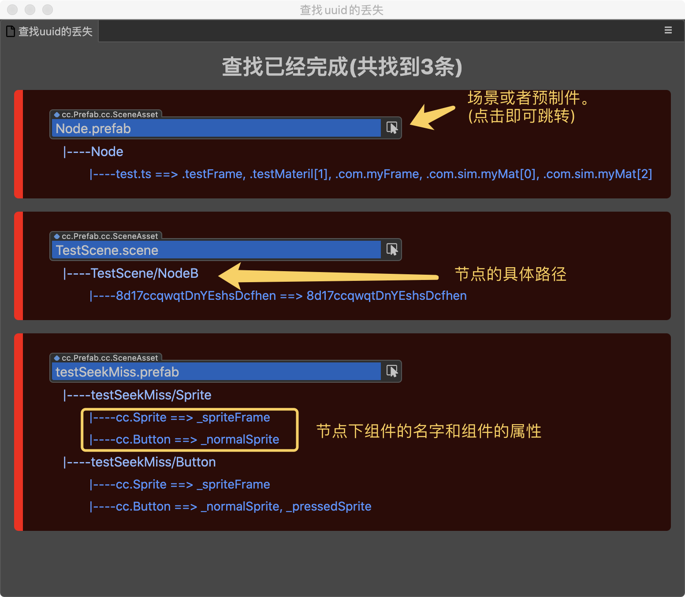
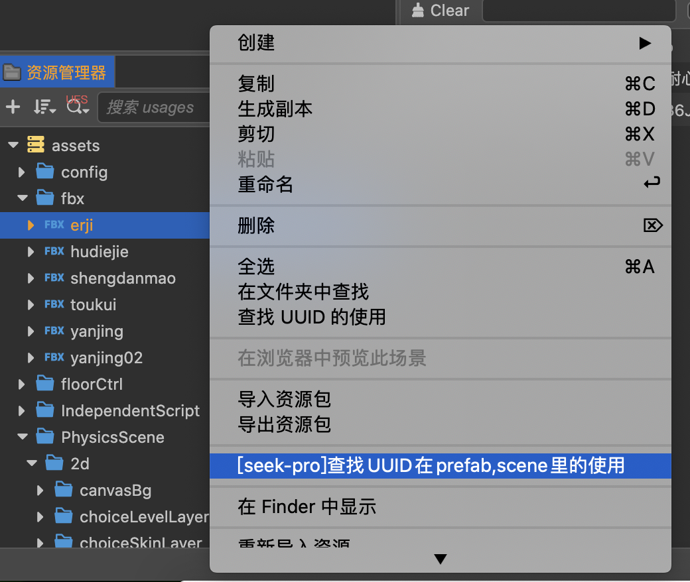
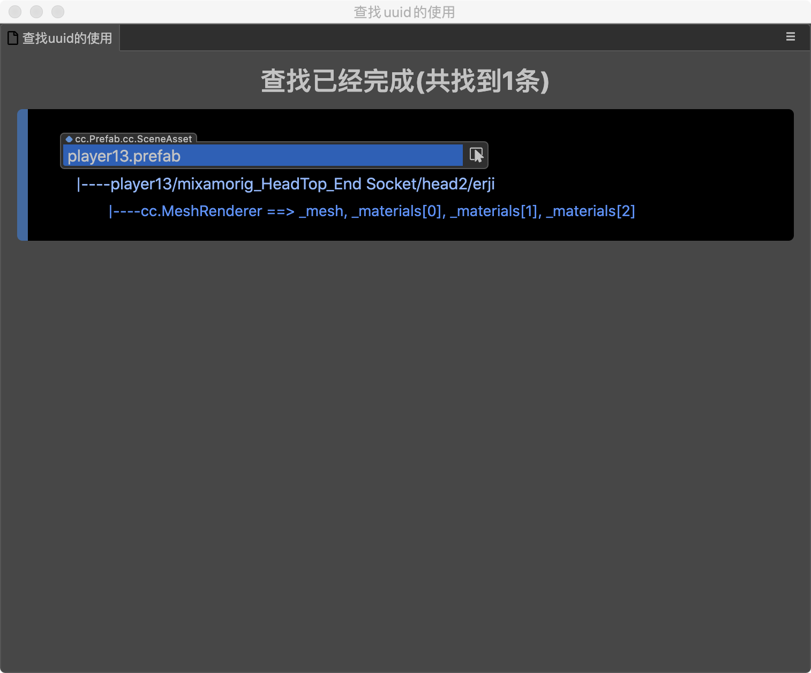

# seek-pro

## 插件简介
本插件会遍历当前项目assets目录下所有的prefab和scene，并列出丢失了uuid引用的所有文件

## 使用场景1:查找丢失的uuid
1. 假设我们创建一个A.prefab。并且在预制件内创建了一个精灵，并且引用了一个B.png来作为spriteFrame。
2. 在某种情况下，我们删除了B.png。在没有主动双击打开A.prefab的情况下，预制件里对B.png的引用其实已经丢失了。但是我们并不知情。
3. 本插件可以在不用双击打开所有的预制件或者场景的情况下，列出所有丢失了uuid应用的文件。

### 使用方法
1. 安装好插件。
2. `扩展 -> seek-pro -> 查找丢失了uuid的预制件或者场景`
3. 或者快捷键 win(`ctrl+F2`), mac(`cmd+F2`)
4. 将会弹出窗口列出所有的查找结果

## 使用场景2：查找UUID的具体使用
1. 我们右键A.png时，会有`查找UUID的使用`这个功能。
2. 但是该功能只会列出所有使用了A.png的预制件或者场景，但是对于节点树上的具体节点却没有显示，如果节点树过大，查找具体的节点也十分费力
3. 本插件提供了`[seek-pro]查找UUID在prefab,scene的具体使用`功能

### 使用方法
1. 安装好插件
2. 在资源上右键`[seek-pro]查找UUID在prefab,scene的具体使用`

3. 将会弹出窗口列出所有的查找结果

